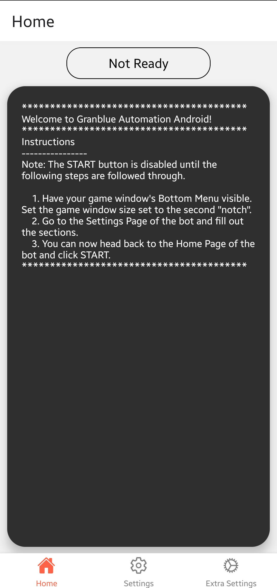

# Granblue Automation For Android using MediaProjection, AccessibilityService, and OpenCV

    

> Discord here: https://discord.gg/5Yv4kqjAbm

> Python version here: https://github.com/steve1316/granblue-automation-pyautogui

> Checkout [Granblue Automation Statistics](https://granblue-automation-statistics.com/) and its project over at https://github.com/steve1316/granblue-automation-statistics

This Android application written in Kotlin and UI in React Native is designed for educational research purposes on studying the Android architecture and using system services such as MediaProjection and AccessibilityService in conjunction with OpenCV to automate certain workflows via image template matching.

Screenshots are taken via the MediaProjection and OpenCV performs image processing. Gestures are performed by AccessibilityService in order to perform various actions such as tapping, swiping or scrolling the screen.

# Table of Contents

-   [Features](#Features)
-   [Requirements](#Requirements)
-   [Instructions](#Instructions)
-   [Technologies used](#Technologies-Used)

## Disclaimer

By downloading this application, you consent to your account potentially getting flagged for excessive usage and banned by KMR. I hold no responsibility for how much you use this application for. I trust you have the self-control necessary to use this application in reasonable bursts of time and to give yourself breaks in between.

# Features

-   [x] Customize what skills to use during each turn in a user-created plan. Users can select which plan to use when starting the bot.
-   [x] GUI to keep track of bot logs, adjust settings, and select what combat script to use.
-   [x] Farm user-defined amounts of specified materials from the supported Farming Modes.
-   [x] Support for the following game modes:
    -   [x] Quest
    -   [x] Special
    -   [x] Coop
    -   [x] Raid
    -   [x] Event
    -   [x] Event (Token Drawboxes)
    -   [x] Rise of the Beasts
    -   [x] Guild Wars
    -   [x] Dread Barrage
    -   [x] Proving Grounds
    -   [x] Xeno Clash
    -   [x] Arcarum
-   [x] Alert for when anti-bot CAPTCHA pops up.
-   [x] Discord integration for informing you of status updates like loot drops via private DMs.

# Requirements

1. [Android Device or Emulator (Nougat 7.0+)](https://developer.android.com/about/versions)
    - APK available to download is for devices that support arm64-v8a and armeabi-v7a ABI. For devices that use a different ABI, follow the instructions below on how to build your own APK.
    - (Experimental) Tablets supported with minimum 1600 pixel width like the Galaxy Tab S7. If oriented portrait, Chrome needs to have Desktop Mode turned off and situated on the left half of the tablet. If landscape, Chrome needs to have Desktop Mode turned on and situated on the left half of the tablet.
    - Tested emulator was Bluestacks 5. Make sure to have the device be in Portrait Mode BEFORE starting the bot as emulators do not have a way to tell the bot that it rotated.
        - In addition, use SkyLeap instead of Google Chrome. Room codes are not able to be properly pasted into Google Chrome while Raid farming on emulators.
2. Display is set to FHD (1080p). If not, then will need to adjust scales in the Extra Settings page to accommodate.
3. [Granblue Fantasy account](http://game.granbluefantasy.jp/)
4. [Twitter Developer account (optional, needed to farm Raids)](https://developer.twitter.com/en)

# Instructions

1. Download the .apk file from the `Releases` section on the right and install it on your Android device. If you want to build the .apk yourself, do the following:
    1. Download and extract the project repository.
    2. Go to `https://opencv.org/releases/` and download OpenCV 4.5.1 (make sure to download the Android version of OpenCV) and extract it.
    3. Create a new folder inside the root of the `android` folder named `opencv` and copy the extracted files in `/OpenCV-android-sdk/sdk/` from Step 2 into it.
    4. Build the Javascript portion of the project by running `yarn install` in the root of the project folder as well.
    5. You can now build and run on your Android Device or create your own .apk file.
    6. You can set `universalApk` to `true` in the `build.gradle` for the application to build a one-for-all .apk file or adjust the `include` to customize which ABI(s) to build the .apk file for.
2. Once the application has started, navigate to the `Settings` page to fill out the necessary sections. Additional settings may be found in the `Extra Settings` page.
3. Once settings have been filled out, a snackbar will pop up indicating when the bot is ready to start.
4. Now you can tap on the `Start` button back in the `Home` page. If this is the first time, it will ask you to give the application `Overlay` permission and then to enable its `Accessibility Service`.
5. Once both are enabled, tapping on the `Start` button again will display an overlay button that you can move around the screen.
6. Navigate yourself to Granblue Fantasy's main page and press the overlay button to start. It is recommended to move the overlay button to the bottom left corner (Google Chrome) or anywhere at the bottom of the screen (SkyLeap) such that it does not cover the `Back` button to avoid interruption.
7. Whenever you want to stop while the bot is running, press the overlay button again to terminate the bot.
8. You can get rid of the overlay button by tapping the `Stop` button back in the `Home` page or tapping the `Stop` button on the application's notification.

## If you want to farm Raids, follow the instructions below:

1. Make sure to run the application at least once. Check the application's `files` folder located inside internal storage's `Android/data/com.steve1316.granblue_automation_android/` directory.
2. Locate the file named `settings.json` file. For ease of use, send it to your computer.
3. Now follow the instructions in [this wiki page](https://github.com/steve1316/granblue-automation-pyautogui/wiki/Instructions-for-Farming-Raids) to obtain your own consumer keys and tokens to connect to the Twitter API.
4. Once you have them, copy them into the respective fields inside `settings.json` using your preferred text editor. After that, move the file back to where it belonged on your Android device.

## Instructions to set up Discord integration

-   Visit [this wiki page](https://github.com/steve1316/granblue-automation-pyautogui/wiki/Instructions-for-Discord-integration) for instructions on setting up Discord integration.

# Technologies Used

1. [MediaProjection - Used to obtain full screenshots](https://developer.android.com/reference/android/media/projection/MediaProjection)
2. [AccessibilityService - Used to dispatch gestures like tapping and scrolling](https://developer.android.com/reference/android/accessibilityservice/AccessibilityService)
3. [OpenCV Android 4.5.1 - Used to template match](https://opencv.org/releases/)
4. [Google Firebase ML Kit - Used for text detection](https://developers.google.com/ml-kit/vision/text-recognition/android)
5. [Hoplite - Used to read settings.json for customized user settings](https://github.com/sksamuel/hoplite)
6. [Twitter4j - Used to connect to Twitter API to fetch room codes](https://github.com/Twitter4J/Twitter4J)
7. [AppUpdater 2.7 - For automatically checking and notifying the user for new app updates](https://github.com/javiersantos/AppUpdater)
8. [React Native 0.64.3 - Used to display the UI and manage bot settings](https://reactnative.dev/)
